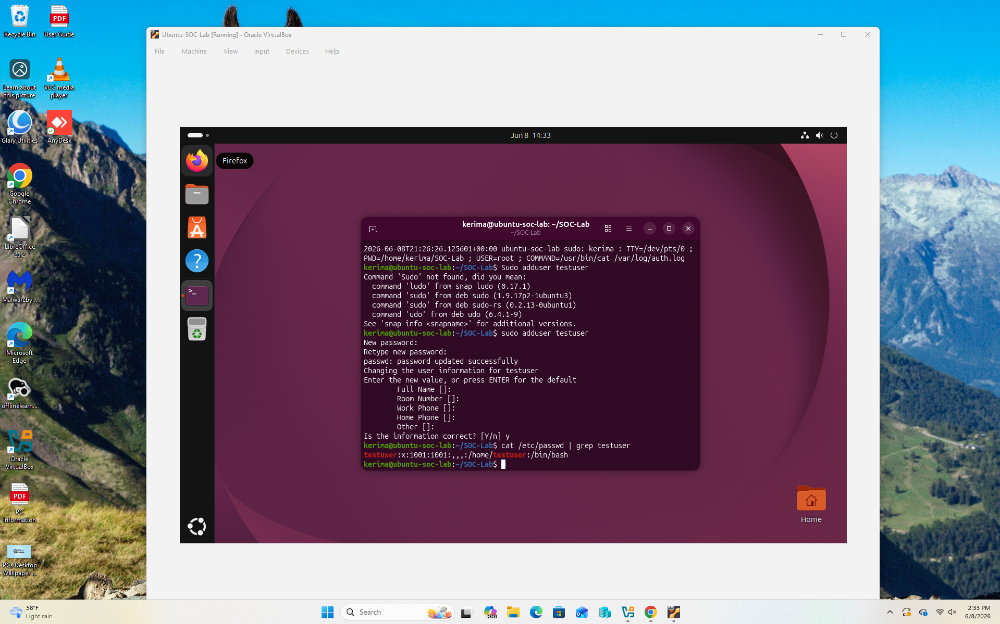
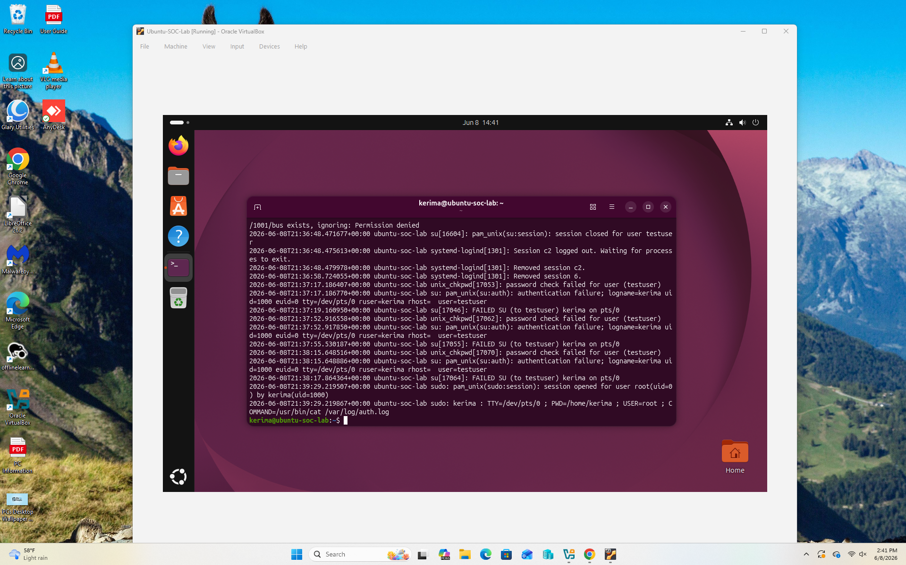
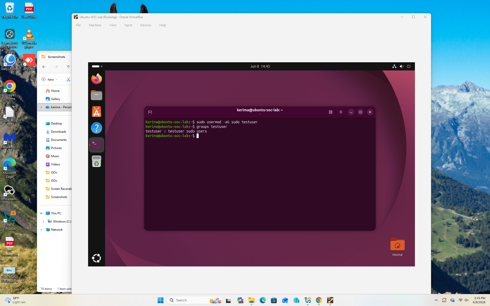

# Linux Authentication Monitoring Lab

## Overview

This project demonstrates basic Security Operations Center (SOC) activities using Ubuntu Linux. The goal was to simulate authentication events, analyze security logs, investigate failed login attempts, and monitor privilege escalation activity.

This lab was performed in Oracle VirtualBox using Ubuntu 26.04 LTS.


## Objectives

- Install and configure Ubuntu Linux
- Create and manage local user accounts
- Generate failed authentication events
- Analyze authentication logs
- Investigate login failures
- Simulate privilege escalation
- Verify security events in log files


## Lab Environment

### Host System
- Windows 11

### Virtualization Platform
- Oracle VirtualBox

### Guest Operating System
- Ubuntu 26.04 LTS


## Skills Demonstrated

- Linux Administration
- User Account Management
- Authentication Monitoring
- Log Analysis
- Privilege Escalation Investigation
- Security Event Analysis
- SOC Fundamentals


## Tools Used

- Ubuntu 26.04 LTS
- Oracle VirtualBox
- Terminal
- Auth Logs (/var/log/auth.log)

# Part 1: User creation
```bash
sudo adduser testuser
```
verified account creation:
```
cat /etc/passwd | grep testuser
```


# Part 2: Failed Authentication Simulation
Attempted to switch to the test account using an incorrect password multiple times: 
```bash
su testuser
```
Generated authentication failures for investigation.



# Part 3: Authentication Log Analysis
Reviewed authentication logs:
```bash
sudo cat /var/log/auth.log | tail -20
```
Observed:
- Authentication failures
- Password check failures
- Failed SU attempts
  
<imag src="screenshots/auth-log-analysis.png" width="600">

# Part 4: Privilege Escalation 
Added testuser to the sudo group:
```bash 
sudo usermod -aG sudo testuser
```
verified group membership:

```bash
groups testuser
```
output:
testuser : testuser sudo users



# Part 5: Privilege Escalation Investigation 
searched authentication logs:
```bash 
sudo cat /var/log/auth.log | grep usermod
```
Obderved: 
usermod: add 'testuser' to group 'sudo'
This event demonstrate how administrator privilege changes can be detected and invetigated.


# Key Security Findings
- Failed login attempts are recorded in auth.log
- User account creation can be verified through Linux account database
- privilege escalation events generate audit records
- Authentication logs provide valuable security monitoring data

# Lesson Learned 
This lab provided hands-on experence with:
- Linux user management
- Security log analysis
- Authentication monitoring
- SOC investigation techniques
- Privilege escalation detection 

